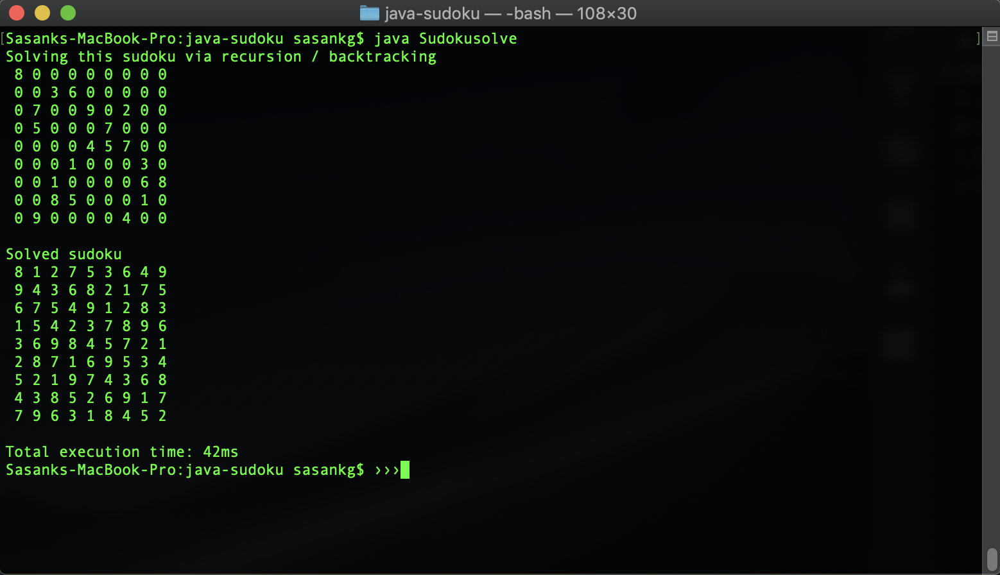

# Java Sudoku Solver

## A Sudoku Solving program utilizing recursion and backtracking algorithms

    

- The sudoku solving program utilizing recursion and backtracking algorithms.
    - The program fills each vacant cell  with a number within the 1 - 9 range before moving on to the next cell.
    - If the subsequent cells result in constraint problems from previous actions the program backtracks to the previous cell and tries another number until there are no constraints

**Author**
- Sasank Ganapthiraju